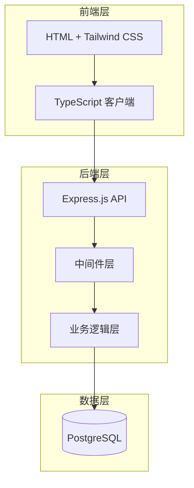

# 设计文档

## 概述

待办事项管理系统采用三层架构设计：前端（HTML + Tailwind CSS + TypeScript）、后端API（Node.js + Express + TypeScript）和数据库层（PostgreSQL）。系统遵循RESTful API设计原则，提供完整的CRUD操作，并确保数据的持久化和一致性。

## 架构

### 系统架构图



### 技术栈

- **前端**: HTML5, Tailwind CSS 3.x, TypeScript 5.x
- **后端**: Node.js 18+, Express.js 4.x, TypeScript 5.x
- **数据库**: PostgreSQL 15+
- **开发工具**: npm/yarn, nodemon, ts-node

## 组件和接口

### 前端组件

#### TodoApp 主组件
- **职责**: 管理应用状态和协调子组件
- **状态**: 
  - `todos: Todo[]` - 待办事项列表
  - `loading: boolean` - 加载状态
  - `error: string | null` - 错误信息

#### TodoForm 组件
- **职责**: 处理新待办事项的创建
- **属性**: 
  - `onSubmit: (description: string) => void`
- **状态**: 
  - `inputValue: string` - 输入框值

#### TodoList 组件
- **职责**: 显示待办事项列表
- **属性**: 
  - `todos: Todo[]`
  - `onToggle: (id: number) => void`
  - `onDelete: (id: number) => void`
  - `onEdit: (id: number, description: string) => void`

#### TodoItem 组件
- **职责**: 单个待办事项的显示和交互
- **属性**: 
  - `todo: Todo`
  - `onToggle: () => void`
  - `onDelete: () => void`
  - `onEdit: (description: string) => void`
- **状态**: 
  - `isEditing: boolean` - 编辑模式
  - `editValue: string` - 编辑时的值

### 后端组件

#### Express 应用结构
```
src/
├── app.ts              # Express 应用配置
├── server.ts           # 服务器启动
├── routes/
│   └── todos.ts        # 待办事项路由
├── controllers/
│   └── todoController.ts # 业务逻辑控制器
├── models/
│   └── todo.ts         # 数据模型
├── database/
│   ├── connection.ts   # 数据库连接
│   └── migrations/     # 数据库迁移
├── middleware/
│   ├── errorHandler.ts # 错误处理中间件
│   └── validation.ts   # 请求验证中间件
└── types/
    └── todo.ts         # TypeScript 类型定义
```

#### API 端点设计

| 方法 | 端点 | 描述 | 请求体 | 响应 |
|------|------|------|--------|------|
| GET | `/api/todos` | 获取所有待办事项 | - | `Todo[]` |
| POST | `/api/todos` | 创建新待办事项 | `{description: string}` | `Todo` |
| PUT | `/api/todos/:id` | 更新待办事项 | `{description?: string, completed?: boolean}` | `Todo` |
| DELETE | `/api/todos/:id` | 删除待办事项 | - | `{message: string}` |

#### 中间件层
- **CORS中间件**: 处理跨域请求
- **JSON解析中间件**: 解析请求体
- **错误处理中间件**: 统一错误响应格式
- **请求验证中间件**: 验证请求参数和数据

## 数据模型

### Todo 数据模型

#### TypeScript 接口
```typescript
interface Todo {
  id: number;
  description: string;
  completed: boolean;
  created_at: Date;
  updated_at: Date;
}

interface CreateTodoRequest {
  description: string;
}

interface UpdateTodoRequest {
  description?: string;
  completed?: boolean;
}
```

#### PostgreSQL 表结构
```sql
CREATE TABLE todos (
  id SERIAL PRIMARY KEY,
  description VARCHAR(500) NOT NULL,
  completed BOOLEAN DEFAULT FALSE,
  created_at TIMESTAMP DEFAULT CURRENT_TIMESTAMP,
  updated_at TIMESTAMP DEFAULT CURRENT_TIMESTAMP
);

-- 创建更新时间触发器
CREATE OR REPLACE FUNCTION update_updated_at_column()
RETURNS TRIGGER AS $$
BEGIN
    NEW.updated_at = CURRENT_TIMESTAMP;
    RETURN NEW;
END;
$$ language 'plpgsql';

CREATE TRIGGER update_todos_updated_at 
    BEFORE UPDATE ON todos 
    FOR EACH ROW 
    EXECUTE FUNCTION update_updated_at_column();
```

### 数据库连接配置
```typescript
interface DatabaseConfig {
  host: string;
  port: number;
  database: string;
  user: string;
  password: string;
  ssl?: boolean;
}
```

## 正确性属性

*属性是一个特征或行为，应该在系统的所有有效执行中保持为真——本质上是关于系统应该做什么的正式声明。属性作为人类可读规范和机器可验证正确性保证之间的桥梁。*

### 属性 1: 任务添加增长列表
*对于任何*任务列表和有效的（非空）任务描述，将其添加到任务列表应该导致任务列表的长度增加一
**验证: 需求 1.1**

### 属性 2: 空白任务无效
*对于任何*完全由空白字符组成的字符串，将其添加到任务列表应该被拒绝，任务列表应该保持不变
**验证: 需求 1.2**

### 属性 3: UI 输入清空
*对于任何*输入栏非空的UI状态，提交输入应该导致输入栏被清空
**验证: 需求 1.3**

### 属性 4: 数据持久化往返
*对于任何*任务，如果它被添加、更新或删除，那么后续的数据库查询应该反映相同的变化
**验证: 需求 1.4, 7.2, 7.3, 7.4**

### 属性 5: 状态切换一致性
*对于任何*任务，切换其完成状态应该在UI和数据库中都反映相同的状态变化
**验证: 需求 3.1, 3.3**

### 属性 6: 任务显示格式
*对于任何*任务，显示时应该清晰地包含任务描述和完成状态，并且完成和未完成任务应该有视觉区别
**验证: 需求 2.2, 3.2, 3.4**

### 属性 7: 编辑操作完整性
*对于任何*有效的任务描述更新，编辑操作应该在UI和数据库中都持久化新的描述
**验证: 需求 5.2, 5.4**

### 属性 8: 编辑取消恢复
*对于任何*正在编辑的任务，取消编辑操作应该恢复原始描述并退出编辑模式
**验证: 需求 5.3**

### 属性 9: 空描述编辑拒绝
*对于任何*编辑操作，尝试保存空白描述应该被拒绝并保持编辑模式
**验证: 需求 5.5**

### 属性 10: API CRUD 操作一致性
*对于任何*有效的CRUD API请求，响应应该包含正确的HTTP状态码和预期的数据格式
**验证: 需求 6.1, 6.2, 6.3, 6.4**

### 属性 11: API 错误处理
*对于任何*无效的API请求，系统应该返回适当的HTTP错误状态码和错误消息
**验证: 需求 6.5**

### 属性 12: UI 响应性更新
*对于任何*数据变化操作（添加、更新、删除），UI应该立即反映这些变化
**验证: 需求 2.5, 3.5, 4.3**

### 属性 13: 错误状态显示
*对于任何*错误情况，界面应该显示适当的错误消息或加载状态
**验证: 需求 8.4, 8.5**

## 错误处理

### 前端错误处理
- **网络错误**: 显示用户友好的错误消息，提供重试选项
- **验证错误**: 实时显示输入验证反馈
- **服务器错误**: 显示通用错误消息，记录详细错误信息

### 后端错误处理
- **400 Bad Request**: 请求参数无效或缺失
- **404 Not Found**: 请求的资源不存在
- **500 Internal Server Error**: 服务器内部错误
- **数据库连接错误**: 优雅降级，返回适当错误响应

### 错误响应格式
```typescript
interface ErrorResponse {
  error: {
    message: string;
    code: string;
    details?: any;
  };
  timestamp: string;
  path: string;
}
```

## 测试策略

### 双重测试方法
- **单元测试**: 验证特定示例、边界情况和错误条件
- **属性测试**: 验证所有输入的通用属性
- 两者互补且都是全面覆盖所必需的

### 单元测试重点
- 特定示例，展示正确行为
- 组件之间的集成点
- 边界情况和错误条件

### 属性测试重点
- 对所有输入都成立的通用属性
- 通过随机化实现全面的输入覆盖

### 属性测试配置
- 每个属性测试最少100次迭代（由于随机化）
- 每个属性测试必须引用其设计文档属性
- 标签格式: **Feature: todo-management, Property {number}: {property_text}**

### 测试框架
- **前端**: Jest + Testing Library
- **后端**: Jest + Supertest
- **属性测试**: fast-check (JavaScript/TypeScript)
- **数据库测试**: 使用测试数据库实例

### 测试覆盖目标
- **单元测试**: 90%+ 代码覆盖率
- **集成测试**: 所有API端点
- **属性测试**: 所有核心业务逻辑
- **端到端测试**: 主要用户流程